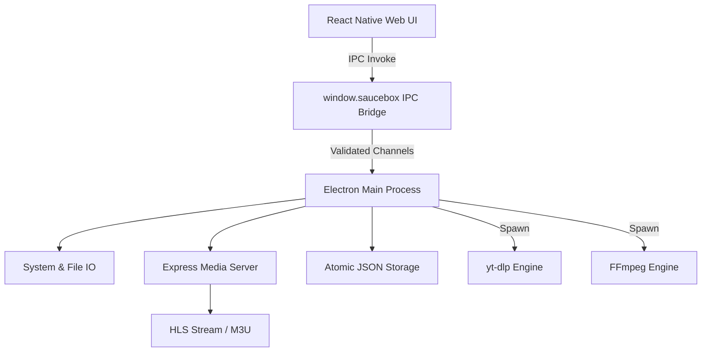

# Contributing to SauceBox

Thank you for your interest in contributing to SauceBox! We welcome all developers, security engineers, and enthusiasts to help build, refine, and secure the ultimate local media manager.

This document serves as the canonical engineering guide for the SauceBox project. It outlines our system architecture, development philosophy, and strict coding standards. Please review this thoroughly before submitting any pull requests.

---

## 🏗️ System Architecture & Engineering Blueprint

SauceBox operates on a highly secure, isolated, cross-platform architecture utilizing **Electron** for the native desktop capabilities and **React Native Web** for the high-performance UI layer.

### Process Isolation & IPC Bridge
To maintain strict security, the React frontend runs in a completely sandboxed renderer process (`nodeIntegration: false`, `contextIsolation: true`). The frontend cannot access the file system directly. All interactions with the OS, file system, or child processes flow through a strongly typed, context-isolated `window.saucebox` IPC bridge defined in `electron/preload.js`.

### Architecture Diagram



### Core Subsystems

1. **State Management & Atomic Persistence**
   - The frontend drives state via `zustand`. 
   - State persistence utilizes a custom asynchronous adapter (`src/store.js`) that pipes updates over IPC to `electron/modules/storage.js`.
   - Data is split into two physical files: `saucebox-settings.json` and `saucebox-gallery.json`.
   - **Crash Immunity:** Storage operations utilize atomic writes—writing first to `.tmp.json` and swapping upon success to guarantee zero data corruption during power loss.

2. **Runtime Provisioning Engine**
   - Instead of bundling massive executables or relying on package managers, SauceBox utilizes a runtime provisioning engine (`electron/modules/provisioning.js`).
   - On first launch, the app dynamically fetches, validates, and installs the required `yt-dlp` and `ffmpeg` binaries for the host OS.
   - Binaries are stored securely in the user's OS application data directory (`~/.config/saucebox/binaries/`, etc.).

3. **Media & Broadcast Server**
   - Built on `express` (`electron/modules/mediaServer.js`), this subsystem streams local media to network devices (Smart TVs, VR headsets).
   - Features dynamic `.m3u` playlist generation, `#EXTART` custom thumbnail injection, and real-time FFmpeg pipe transcoding to handle web-incompatible formats (`.mkv`, `.webm`) on the fly.

---

## 📁 Source Code Topology

SauceBox strictly adheres to a **feature-as-a-folder** pattern. No source code file should exceed 500-600 lines. Modularity is mandatory.

```text
SauceBox/
├── docs/                                  # Engineering and design documentation
├── electron/                              # Main process backend
│   ├── main.js                            # App lifecycle and window manager
│   ├── preload.js                         # IPC gateway and isolated API exposure
│   └── modules/                           # Decomposed backend microservices
│       ├── downloader.js                  # yt-dlp scraping and orchestrator
│       ├── extensionServer.js             # Local HTTP port for browser extension
│       ├── ffmpegProcessing.js            # Video snapshotting and lossless trimming
│       ├── mediaServer.js                 # Network streaming and M3U routing
│       └── storage.js                     # Atomic filesystem writes
├── src/                                   # Frontend React Native Web client
│   ├── components/                        # Modular UI components
│   │   ├── AppLock.js                     # Security vault overlay
│   │   ├── VideoPlayer.js                 # Core HTML5 video player and trimmer
│   │   ├── Help/                          # Documentation modal components
│   │   └── tabs/                          # Main navigation view orchestrators
│   ├── store.js                           # Global Zustand configuration
│   ├── theme.js                           # Strict styling tokens
│   └── App.js                             # Root router and IPC listener
├── chrome-extension/                      # Manifest V3 browser companion plugin
└── package.json                           # Dependencies and electron-builder configs
```

---

## 💻 Development Standards & Protocols

### 1. Modularity & File Constraints
Keep everything strictly modular. If a component (e.g., a tab view) begins to exceed 500 lines, you must decompose it. Extract complex inputs, list items, or forms into sub-components inside a dedicated directory (e.g., `src/components/tabs/Playlists/`).

### 2. Design System & Objective Styling
- **Color Identity:** The primary brand identity color is **Vibrant Orange** (`#FF8C00`). Accentuate layouts using dark modes (`#0a0a0a`), smooth gradients, and micro-animations.
- **Button Contrast:** Primary actionable buttons must utilize a solid vibrant orange background with bold black text (`#000000`) for maximum contrast.
- **Tooltips:** Every actionable button (delete, reorder, edit) must be wrapped in our custom `<Tooltip>` component. Native browser tooltips (`title`) are strictly banned.
- **Objective Documentation Ban:** Never use subjective, self-promotional, or marketing-heavy adjectives in comments, UI text, or commit messages (e.g., "beautiful", "gorgeous", "visually stunning", "premium", "sleek"). Keep all terminology highly technical, precise, and objective.

### 3. Production-Grade Integrity
- **No Placeholders:** We do not accept mocks, temporary code, or `TODO` statements. Every line merged must be production-ready and fully implemented.
- **Build Checks:** Always run `npm run build` after any edit. Fix all errors and warnings fully. Never leave any warnings of any kind, including version or dependency warnings.
- **Version Bumping:** When bumping version numbers in `CHANGELOG.md`, you must bump all other references including `package.json` and source code constants.

---

## 🚀 Environment Setup & Workflow

### 1. Environment Requirements
- **Node.js** (v18 or higher)
- **Git**
- *Note: SauceBox provisions its own `yt-dlp` and `ffmpeg` binaries automatically during development.*

### 2. Initialization
Clone the repository and install dependencies:
```bash
git clone https://github.com/CLOUDWERX-DEV/SauceBox.git
cd SauceBox
npm install
```

### 3. Running the Development Server
Launch the Webpack dev server and Electron wrapper simultaneously:
```bash
npm run dev
```
*Note: Any changes to the React frontend will hot-reload. Changes to the `electron/` backend require manually restarting the process.*

### 4. Build Verification
Before submitting code, ensure the production build compiles without a single error or warning:
```bash
npm run build
```

---

## 🛡️ Pull Request Guidelines

When submitting a Pull Request, please ensure the following:
1. **Changelog Updates:** Document your exact technical changes in `CHANGELOG.md` under the appropriate semantic version header.
2. **Commit Formatting:** Write clean, imperative, and technical commit messages (e.g., `fix(playlists): resolve cover art live preview bug on unsaved drafts`).
3. **Privacy Absolute:** Ensure all data, history, and metrics remain localized to the host OS. Never introduce remote analytics, cloud syncs, or telemetry.
4. **Testing:** Run the application locally and verify that the core functions (Downloading, Playing, Playlist creation, Server broadcasting) remain intact.

*Maintained and engineered by CLOUDWERX LAB.*
