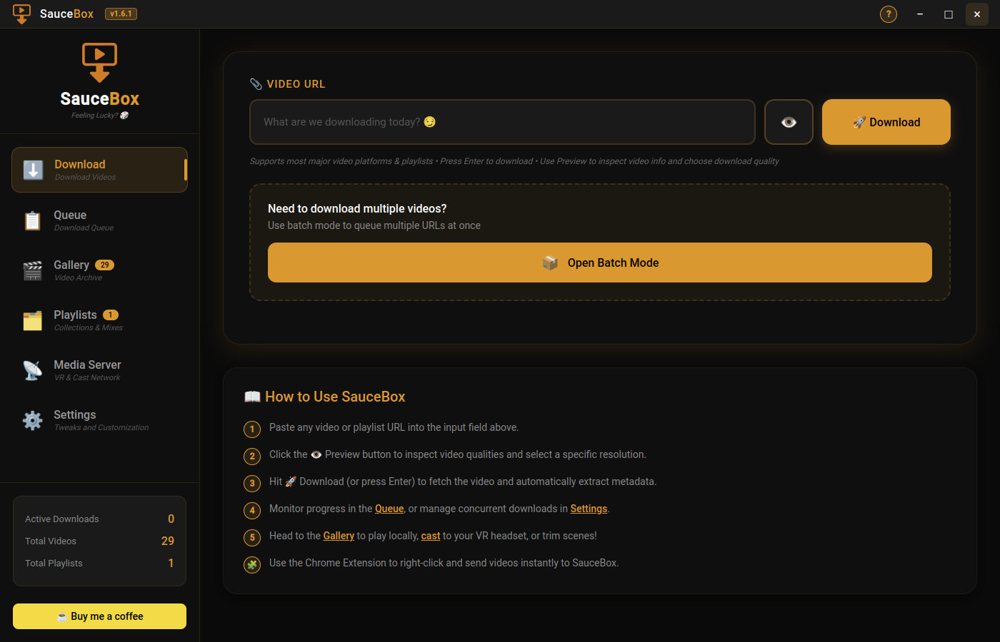

<p align="center">
  
</p>

<h1 align="center">SauceBox</h1>

<p align="center">
  <strong>Download, organize, and stream adult content — all from one app! SauceBox.</strong><br/>
  <em>Your sauce. Your box. Your rules.</em><br/><br/>
  <a href="https://saucebox.app">saucebox.app</a>
</p>

<p align="center">
  
</p>

<p align="center">
  SauceBox combines the raw power of <code>yt-dlp</code> with a premium desktop interface to give adult content enthusiasts a fully private, locally-hosted media empire — with VR broadcasting, batch downloading, and a panic-button stealth mode built right in.
</p>

---

## 🚀 The Ultimate Feature Set

### 📥 Massive Playlist Support & Selection
Paste a playlist URL and SauceBox instantly pulls all the metadata into a beautiful modal grid. Choose to download the **entire playlist** with one click, or selectively pick and choose only the videos you want.

### 🗄️ Beautiful Video Gallery & Media Management 🏷️
Your `Gallery` tab isn't just a log—it's a fully-fledged video manager. Search through your local archive, view rich metadata, sort your collection, and give videos a **Star Rating**. Use the **Smart Tagging** system to create your own categories (like "Favorites" or "Cinematic") and instantly filter your massive archive to find exactly what you're looking for.

### 💾 Bulletproof Native Storage
SauceBox doesn't rely on volatile browser caches. Your entire database is split into two beautifully formatted, human-readable JSON files (`saucebox-gallery.json` and `saucebox-settings.json`) that are securely written directly to your operating system's native application data directory using atomic file writes. This guarantees your data survives app updates, prevents loss when caches are cleared, makes backups as easy as copying two files, and allows you to manually tweak advanced settings directly in a text editor!

### 🎥 Robust Local Importing
Already have a massive stash on your hard drive? Use the **Import** feature to ingest entire folders or specific files into your SauceBox Gallery. Choose between single-file wizard editing, bulk uniform metadata, or fully automated metadata scraping. SauceBox will use `ffmpeg` to instantly generate high-quality thumbnails, scrape true video durations, extract exact resolutions, and calculate real file sizes for everything you import.

### 🤖 Auto-Tagging & Smart Metadata Extraction
As videos download, SauceBox intelligently extracts metadata on the fly. The **Auto-Tagging** feature automatically categorizes your new videos based on their source domain/provider (e.g., Pornhub, Spankbang), keeping your Gallery clean and organized without lifting a finger. If you ever need to change things, hit the **Edit** button on any card to update Titles, Creators, and Tags on the fly.

### 🎬 Native Playback & Visual Video Trimmer ✂️
No need to hunt down files in your system explorer. SauceBox features a gorgeous, built-in **In-App Video Player** to watch your files instantly. Want to clip a custom highlight without re-encoding or losing video quality? Use our premium **Visual Video Trimmer**:
*   **Dual-Slider Scrubbing Track**: Grab the two orange trimmer handles and visually drag them frame-by-frame on a scrubbing timeline with real-time video feedback.
*   **Quick-Cut Snapping**: Instantly snap the start or end handles to the exact millisecond of the player's active position using the `[ Set Start ]` and `[ Set End ]` buttons.
*   **Lossless Extraction**: SauceBox leverages `ffmpeg` to slice your clips instantly in high speed, preserving 100% video quality. The trim is automatically saved as a fresh, standalone card in your gallery, leaving the original video completely untouched.

### 🗂️ Curated Playlists & Curations Builder
Curate, edit, and play custom video collections dynamically with our premium **Playlists** engine:
*   **Isolated Draft States**: Creating or editing a playlist opens a safe, temporary local draft. Edits (adding, removing, reordering, custom cover art, renaming) are held in memory and are only written to the database when you click the orange **Save & Return** button. Discarding exits cleanly without polluting your collection.
*   **Interactive Dual-Pane curating**: Curate in real time using our dual-pane layout. The left panel shows all available gallery videos with search filtering, sorting keys, resolution, and star-ratings. The right panel displays your active playlist sequence, supporting drag-and-drop manual ordering or instant sequence input numbering.
*   **Sequenced Playback & Auto-Advance**: Launch a playlist in the built-in player, and SauceBox will automatically advance to the next video when the active one ends. Or, if a custom external player (like VLC or MPV) is enabled in Settings, the app will pass the entire playlist sequence directly to your external player!
*   **High-Contrast Stats Badges**: The Playlists gallery header displays real-time combined statistics summarizing total playlist count, unique file storage size, and cumulative playtime.

### ⏸️ Flawless Pause & Resume
Got to go? Click Pause, or just close the app entirely. SauceBox intelligently saves the exact byte position of your active downloads. When you start the app again, it automatically queues your pending downloads so you can resume them flawlessly.

### 🔒 Vault Lock & Deep Stealth Mode 🥷
Absolute privacy is guaranteed. Enable **Vault Mode** in the settings to protect the app behind a 4-digit PIN lock screen on startup. And if someone walks in the room, smash the **Stealth Hotkey** (`Ctrl + Shift + H` by default) to instantly hide the app from the taskbar, pause all active downloads, and mute any playing video. Configure stealth options specifically to your liking.

### 🌐 "Send to SauceBox" Browser Extension
Skip the copy-pasting entirely. Install the included Chrome Companion Extension to simply right-click any video on your favorite tube sites and click "Send to SauceBox", or **click the extension icon** in your toolbar to instantly send the current page URL. The built-in local background server will instantly grab the URL and start downloading it in the app automatically.

### 📡 Media Server & VR Broadcast
SauceBox features a built-in media server that generates dynamic M3U playlists of your gallery. Instantly stream your videos to your Smart TV, phone, or VR headset. Includes "Quick Cast" for 1-click single-video streaming directly from the gallery, on-the-fly `.mkv` to `.mp4` transcoding, and rich metadata injection so premium VR players show your beautiful cover art and custom tags natively.

### ⚙️ Deep Configuration
*   **Dependency Management:** Built-in auto-detection for `yt-dlp` and `ffmpeg` with simple, cross-platform installation instructions and UI file-browsers if you use portable binaries.
*   **Bandwidth Throttling:** Limit download speeds (KB/s) so SauceBox doesn't choke your network.
*   **Format Selection:** Choose your preferred video container (`.mp4`, `.mkv`, `.webm`).
*   **Network Proxies:** Built-in proxy fields to bypass ISP and regional censorship effortlessly.
*   **System Integration:** Native desktop notifications when downloads finish or fail.
*   **Auto-Clear:** Automatically sweep completed videos from your active queue into your history.
*   **Safe-Guards:** Prevent full-disk errors with intelligent Free-Space Monitoring before downloads begin.

---

## 🔞 Supported Sites
SauceBox natively supports thousands of video platforms via `yt-dlp`. Here are the core adult networks explicitly supported and tested:

- **Pornhub** — `PornHub`, `PornHubPagedVideoList`, `PornHubPlaylist`, `PornHubUser`
- **4tube** — `4tube`
- **Beeg** — `Beeg`
- **CAM4** — `CAM4`
- **Camsoda** — `Camsoda`
- **Chaturbate** — `Chaturbate`
- **Eporner** — `Eporner`
- **HellPorno** — `HellPorno`
- **Motherless** — `Motherless`, `MotherlessGallery`
- **Nuvid** — `Nuvid`
- **RedTube** — `RedTube`
- **SpankBang** — `SpankBang`, `SpankBangPlaylist`
- **Stripchat** — `Stripchat`
- **ThisVid** — `ThisVid`
- **Xvideos** — Included under Pornhub extractors

---

## 📦 Cross-Platform Installation

SauceBox is fully cross-platform and can be compiled into native installers for **Windows**, **macOS**, and **Linux**.

### 1. Development Setup
To build or run from source:

```bash
git clone https://github.com/CLOUDWERX-DEV/SauceBox.git
cd SauceBox
npm install
```
**Requirements:** Make sure you have `yt-dlp` and `ffmpeg` installed and accessible in your system's PATH.

### 2. Building Releases
We use `electron-builder` to package native applications.
- **Linux** (AppImage, deb, rpm, pacman): `npm run dist -- --linux`
- **Windows** (NSIS Installer, Portable): `npm run dist -- --win`
- **macOS** (DMG, Zip): `npm run dist -- --mac`

*See [docs/RELEASES.md](docs/RELEASES.md) for a complete, in-depth guide on building and deploying cross-platform releases.*

### 🧩 Installing the Chrome Extension
1. Open Google Chrome or any Chromium browser.
2. Go to `chrome://extensions/`.
3. Toggle **Developer mode** in the top right.
4. Click **Load unpacked** and select the `chrome-extension/` folder located inside the SauceBox directory.

## 🛠️ Usage

Run the app in development mode with hot-reloading:

```bash
npm run dev
```

Build the app for production:

```bash
npm run build
npm start
```

## 💖 Support the Developer

If you love using this app, consider supporting its future development by buying me a coffee!

<a href="https://buymeacoffee.com/cloudwerxl3" target="_blank">
  
</a>

---

<p align="center">
  Made with 🔥 and React Native by <a href="http://cloudwerxlab.com">CLOUDWERX LAB</a>
</p>
